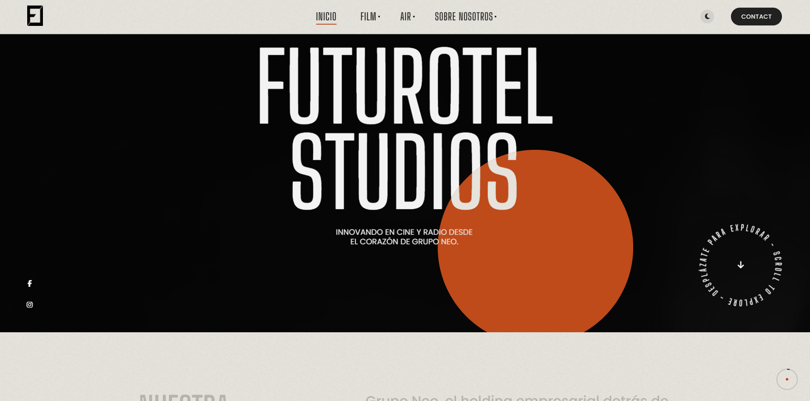

# Futurotel Studios Landing 🚀


Landing Page oficial y vanguardista para **Futurotel Studios**, incluyendo divisiones como **Futurotel Films** y **Futurotel Air**. Este proyecto está diseñado para impresionar y captar la atención de tus visitantes desde el primer segundo.

---

## 🌟 Visión
"Innovar en el sector audiovisual y tecnológico, presentando la creatividad y profesionalismo de Futurotel Studios al mundo, a través de una experiencia web memorable."

---

## 🖥️ Demo
> 

---

## ✨ Características Destacadas
- **Diseño moderno, elegante y 100% responsivo**
- **Animaciones de transición suaves** y cursor mágico personalizado
- **Modo claro** por defecto (personalizable)
- **Optimización móvil** y para SEO básico
- **Google Fonts**: Poppins y Big Shoulders Display
- **Librerías premium**: FontAwesome (íconos), Fancybox (lightbox), Swiper (carruseles)
- **Estructura modular** para fácil expansión
- **Código limpio y comentado**

---

## 📂 Estructura del Proyecto
```
Futurotel-Studios-Landing/
├── index.html                # Página principal
├── about.html, air.html...   # Secciones adicionales
├── assets/
│   ├── css/                  # Estilos principales (theme.css, theme-light.css, helper.css...)
│   ├── js/                   # Scripts (theme.js)
│   ├── img/                  # Imágenes
│   ├── vids/                 # Videos
│   └── vendor/               # Librerías externas (FontAwesome, Swiper, Fancybox...)
├── favicon.ico
└── ...
```

---

## ⚡ Instalación y Uso
1. **Descarga o clona** este repositorio.
2. Abre `index.html` en tu navegador preferido.
3. ¡Listo! No se requieren dependencias ni instalaciones adicionales.

---

## 🛠️ Personalización
- Modifica los archivos en `assets/css/` para cambiar la apariencia.
- Edita los HTML para actualizar el contenido.
- Sustituye imágenes en `assets/img/` y videos en `assets/vids/` según tu branding.
- Para añadir nuevas secciones, duplica un HTML y enlázalo desde el menú.

---

## 🚀 Despliegue
- Puedes alojar este sitio en cualquier servidor estático (Netlify, Vercel, GitHub Pages, etc.).
- **Recomendación:** Minifica CSS/JS para mayor rendimiento en producción.

---

## 🧩 Tecnologías y Librerías
- **HTML5, CSS3, JavaScript** puro
- [FontAwesome](https://fontawesome.com/), [Fancybox](https://fancyapps.com/), [Swiper](https://swiperjs.com/)
- [Google Fonts](https://fonts.google.com/)

---

## 🗺️ Roadmap
- [ ] Multi-idioma (internacionalización)
- [ ] Blog de novedades
- [ ] Integración con redes sociales y newsletter
- [ ] Animaciones avanzadas y microinteracciones

---

## 🤝 Contribuciones
¡Las contribuciones son bienvenidas! Para proponer mejoras o reportar bugs:
1. Haz un fork del repositorio
2. Crea una rama nueva (`feature/nueva-funcionalidad`)
3. Realiza tus cambios y haz un Pull Request

---

## 💬 Soporte
¿Tienes dudas, sugerencias o necesitas soporte?
- Email: [contacto@futurotelstudios.com](https://www.futurotelgroup.com/)

---

## 📜 Créditos y Licencia

- **Diseño, desarrollo y visión:** [Futurotel Studios](https://www.futurotelstudios.com)
- **Inspiración y colaboración:** Comunidad creativa, partners y usuarios que confían en nosotros
- **Tecnologías clave:**
  - [HTML5](https://developer.mozilla.org/en-US/docs/Web/Guide/HTML/HTML5)
  - [CSS3](https://developer.mozilla.org/en-US/docs/Web/CSS/CSS3)
  - [JavaScript](https://developer.mozilla.org/en-US/docs/Web/JavaScript)
  - [FontAwesome](https://fontawesome.com/), [Fancybox](https://fancyapps.com/), [Swiper](https://swiperjs.com/), [Google Fonts](https://fonts.google.com/)
- **Licencia:** Este proyecto está bajo la licencia [MIT](LICENSE). Puedes usarlo, modificarlo y compartirlo, siempre respetando los términos y dando crédito a los autores originales.

---

> "La innovación no es solo tecnología, es creatividad, pasión y visión compartida. Gracias por ser parte de la evolución Futurotel Studios."

- ¿Quieres colaborar, proponer mejoras o inspirar nuevas funcionalidades? ¡Contáctanos y forma parte de nuestra comunidad global!

---

> _Impulsando el futuro a través de la creatividad y la tecnología._

---
